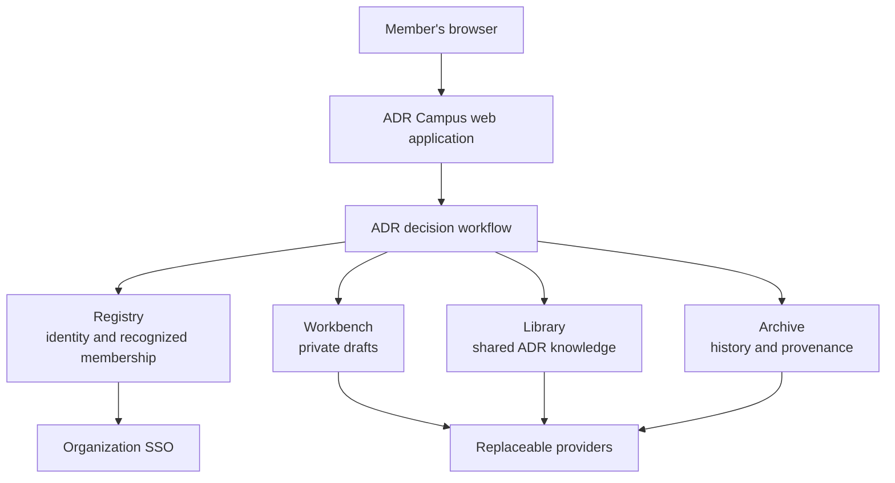

# Architecture Overview

## ADR Campus

ADR Campus is a server-hosted application for maintaining one organization's architectural decision record. It is composed as an Aetheric Forge Campus and expresses its application behavior through the Runtime's public institutional contracts.

This document describes the application boundary and the responsibilities of its major parts. The Aetheric Forge Runtime already defines institutional composition, capability resolution, lifecycle, authorities, services, and providers; those mechanisms are not repeated here. The [Runtime architecture](../../runtime/docs/architecture/overview.md) remains the reference for them.

The [user stories](../stories/overview.md) are authoritative for observable product behavior. This overview explains where that behavior belongs.

## Application Shape

ADR Campus has three application-level concerns:

- the web experience presents commands and read models to members;
- the ADR decision workflow enforces lifecycle, authorization, and consistency rules; and
- the Campus institutions provide the higher-level identity, work, knowledge, and historical capabilities needed by that workflow.

The first release is a modular application deployed as one server process. The diagram expresses responsibility, not separate network services or databases.

## Institutional Composition

ADR Campus uses a single `ICampus` as its root institutional scope. Its standard Runtime institutions retain their constitutional meanings.

### Registry

The Registry integrates the organization’s configured SSO authority and resolves stable identities. ADR Campus uses current SSO group state to determine effective Member and Maintainer authority.

The Registry does not make ADR Campus the owner of users, credentials, or group membership. The application keeps only the projection and historical identity references required for authorization, attribution, and draft recovery. Changes to users and groups remain in the SSO control plane.

### Workbench

The Workbench is the home of private, provisional ADR work. A draft is incomplete work owned by its author; saving, previewing, conflict detection, recovery, and expiry all occur before the record becomes shared organizational knowledge.

Moving a draft from `Draft` to `Proposed` is an explicit application transition. It releases a validated, immutable revision from the Workbench into the organization's shared decision record. Workbench staging alone never gives a draft organizational authority.

### Library

The Library makes proposed and decided ADRs discoverable and intelligible. It supports the shared collection, including search, filtering, stable pagination, lifecycle presentation, and navigation through supersession relationships.

An ADR is modeled as application-specific knowledge with durable identity, content, provenance, lifecycle state, and relationships. Library curation makes that knowledge available; it does not by itself accept a proposal or confer organizational authority.

### Archive

The Archive preserves the evidence needed to understand the decision record over time: proposals, decisions, lifecycle transitions, supersession, attribution, and application-administration events. History is append-only from the application's point of view; later events describe change rather than rewriting earlier events.

The Archive is not the primary query model for the user interface. Read projections may be built for efficient discovery, provided they remain derivable from and consistent with the authoritative application state and history.

### Post Office

The Campus supplies a Post Office as part of the standard Runtime composition, but the first-release stories define no notifications or external message exchange. ADR Campus therefore does not introduce an application postal contract until a concrete asynchronous collaboration requirement exists.

## ADR Decision Workflow

The Runtime provides institutional capabilities; ADR Campus owns the meaning of an architectural decision. The application domain defines:

- the ADR aggregate and its organization-scoped stable identity;
- the `Draft`, `Proposed`, `Accepted`, `Rejected`, and `Superseded` states;
- the commands that move an ADR through that lifecycle;
- content and transition validation;
- authorship, proposal, decision, and supersession rules;
- visibility and authorization rules; and
- the history and relationships produced by successful transitions.

Each command is authorized and validated when it is committed, not merely when its page is opened. Transitions that affect several records or projections—especially proposal, decision, reassignment, and supersession—are atomic and idempotent. Concurrent attempts must produce one coherent outcome rather than partially changing the decision record.

The workflow coordinates institutions through their public contracts. It does not reach through an Institution to select its provider, storage engine, or internal authority.

## Web Boundary

The web project is the composition root and delivery boundary. It:

- configures and starts the ADR Campus institutional composition;
- authenticates the current principal and establishes request context;
- translates member actions into application commands and queries;
- renders server-authorized views and validation outcomes; and
- keeps privileged SSO access and provider credentials on the server.

UI components contain presentation behavior only. They do not decide lifecycle transitions, infer authority from displayed state, or access persistence providers directly. Search, filtering, sorting, and pagination are evaluated server-side over authorization-aware read models.

## State and Consistency

ADR Campus distinguishes three forms of state:

| State               | Purpose                                                          | Architectural owner           |
| ------------------- | ---------------------------------------------------------------- | ----------------------------- |
| Provisional work    | Private drafts and recovery deadlines                            | Workbench-backed ADR workflow |
| Current knowledge   | Shared ADR content, status, and relationships used for discovery | Library-backed read model     |
| Historical evidence | Immutable lifecycle, attribution, and administration history     | Archive                       |

These may share one physical store in the first deployment. Their different meanings and access rules remain explicit even when infrastructure is consolidated.

The application treats persisted domain state as authoritative for ADR lifecycle and treats sufficiently current SSO state as authoritative for access. Cached or projected data may improve reads, but it cannot grant authority, expose a private draft, or report a transition that has not committed. Protected mutations fail closed when current authority cannot be established.

## Infrastructure Boundary

Concrete choices for database, search indexing, SSO protocol, object storage, scheduling, and messaging belong behind Runtime or application provider contracts. They are deployment decisions rather than properties of the ADR model.

The first implementation should prefer the smallest infrastructure that preserves the story invariants. Separating responsibilities in the architecture does not require deploying each responsibility independently.

## Dependency Direction

Dependencies point inward:

1. web components depend on application commands, queries, and read models;
2. the ADR workflow depends on its domain model and Runtime institutional contracts;
3. provider implementations depend on external technologies; and
4. composition in the web host connects implementations to contracts.

The domain model does not depend on Razor components, SSO vendor APIs, databases, queues, or Runtime provider implementations. This keeps the decision rules testable and allows infrastructure to change without changing what an ADR means.

## First-Release Boundary

The initial architecture supports one organization, one configured SSO authority, and the complete ADR lifecycle described by the stories. It deliberately does not introduce distributed services, general workflow machinery, custom governance engines, local user administration, notifications, or public access.

Additional architecture documents should be added only when an implementation decision needs durable explanation. Cross-cutting choices with meaningful alternatives or consequences should be recorded as ADRs rather than expanding this overview into a duplicate Runtime design.
